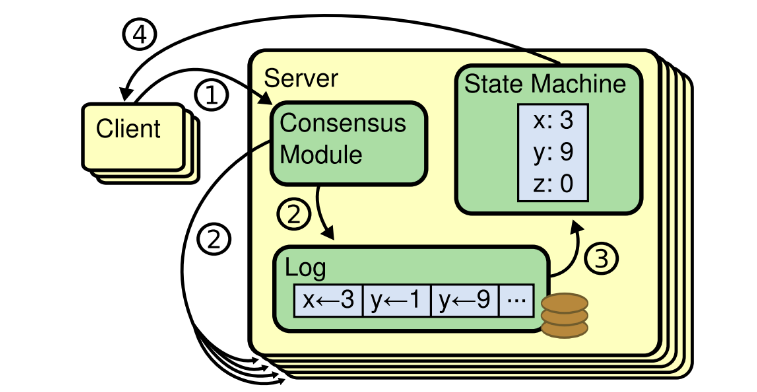
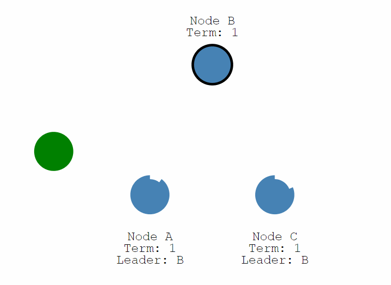

##什么是分布式一致性？
分布式系统通常由异步网络连接的多个节点构成，每个节点有独立的计算和存储，节点之间通过网络通信进行协作。分布式一致性指多个节点对某一变量的取值达成一致，一旦达成一致，则变量的本次取值即被确定。
在大量客户端并发请求读/写的情况下，维护数据多副本的一致性无疑非常重要，且富有挑战。因此，分布式一致性在我们生产环境中显得尤为重要。
总结来讲，分布式一致性就是为了解决以下两个问题：
* 数据不能存在单个节点（主机）上，否则可能出现单点故障。
* 多个节点（主机）需要保证具有相同的数据。

## 常见分布式一致性算法
* Paxos算法是Lamport宗师提出的一种基于消息传递的分布式一致性算法，使其获得2013年图灵奖。自Paxos问世以来就持续垄断了分布式一致性算法，Paxos这个名词几乎等同于分布式一致性, 很多分布式一致性算法都由Paxos演变而来
* Paxos是出了名的难懂，而Raft正是为了探索一种更易于理解的一致性算法而产生的。它的首要设计目的就是易于理解，所以在选主的冲突处理等方式上它都选择了非常简单明了的解决方案。
* ZAB 协议全称：Zookeeper Atomic Broadcast（Zookeeper 原子广播协议）, 它应该是所有一致性协议中生产环境中应用最多的了。为什么呢？因为他是为 Zookeeper 设计的分布式一致性协议！

##深入Raft算法
Raft算法和其他分布式一致算法一样，内部采用如下图所示的复制状态机模型，在这个模型中，会利用多台服务器构成一个集群，工作流程如下图所示：

整个工作流程可以归纳为如下几步：
1. 用户输入设置指令，比如将设置y为1，然后将y更改为9.
2. 集群收到用户指令之后，会将该指令同步到集群中的多台服务器上，这里你可以认为所有的变更操作都会写入到每个服务器的Log文件中。
3. 根据Log中的指令序列，集群可以计算出每个变量对应的最新状态，比如y的值为9.
4. 用户可以通过算法提供的API来获取到最新的变量状态。

算法会保证变量的状态在整个集群内部是统一的，并且当集群中的部分服务器宕机后，仍然能稳定的对外提供服务。
Raft算法在具体实现中，将分布式一致性问题分解为了Leader选举、日志同步和安全性保证三大子问题，接下来我会对这三方面进行仔细讲解。

## Raft算法基础
Raft 正常工作时的流程如下图，也就是正常情况下日志复制的流程。Raft 中使用日志来记录所有操作，所有结点都有自己的日志列表来记录所有请求。算法将机器分成三种角色：Leader、Follower 和 Candidate。正常情况下只存在一个 Leader，其他均为 Follower，所有客户端都与 Leader 进行交互。

